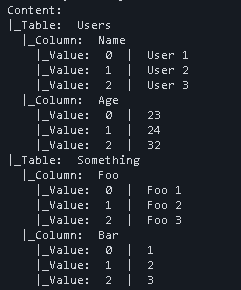
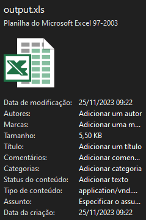
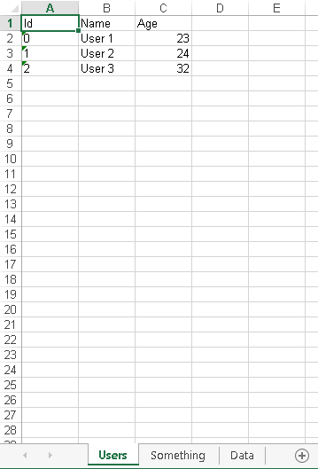

# JPyDB

**MrJuaumBR == MrPotatoBR == MrJuaum == MrPotato**

*All  of  these  are the same people*

# Installation
**First read requirements.txt**
*0.8: auto download dependencies*
```shell
pip install "git+https://github.com/MrJuaumBR/JPyDB" # Install from github

pip install -i https://test.pypi.org/simple/ JPyDB # Install from Test PyPi

```

# Prompts
```shell
# Pre Build by setup.py
py setup.py build

# Build Package
py -m build

# Local Update
pip install . --upgrade

# Send to TestPyPi
python -m twine upload --repository-url https://test.pypi.org/legacy/ dist/*
python -m twine upload --repository testpypi dist/*
```

# Our Lines
*Inspired in SQL*
*Made using: Base64 and pickle*

*Used Only Python to this*

*Join our [Discord](https://discord.gg/fb84sHDX7R) Server*

# Sheet Output
## How to use?
    - Create your database, Add Tables and Values;
    - Save this(Need to save before to getSheet);
    - use Handler.GetSheet(arg) (arg = output file name e.g. 'data')
    - Will Return a .xls;
    - open this!

e.g.

```py
    from JPyDB import pyDatabase

    dbh = pyDatabase('database') # Load Handler and Database
    db = dbh.db() # Get Database cursor

    # Create Table
    db.create_table('Users')
    db.create_table('Something',[('Foo',str),('Bar',int)])

    # Add Columns
    db.add_column('Users','Name',str,False)
    db.add_column('Users','Age',int,False)

    # Add Values
    db.add_values('Users',db.tables['Users'].columns.keys(),['User 1',23],0) # Add multiples values
    db.add_values('Users',['Name','Age'],['User 2',24],1) # Other form
    db.add_values('Users',['Name','Age'],['User 3',32],2)

    db.add_values('Something',['Foo','Bar'],['Foo 1',1],0)
    db.add_values('Something',['Foo','Bar'],['Foo 2',2],1)
    db.add_values('Something',['Foo','Bar'],['Foo 3',3],2)

    # Save
    db.save()

    # Get Sheet
    dbh.GetSheet('output')
```

# Images




# Contacts

[Discord](https://discord.gg/fb84sHDX7R)

[YouTube](https://www.youtube.com/channel/UClcAmcdF0OvAOEgiKr5NgYQ)

[Test PyPi](https://test.pypi.org/project/JPyDB/)